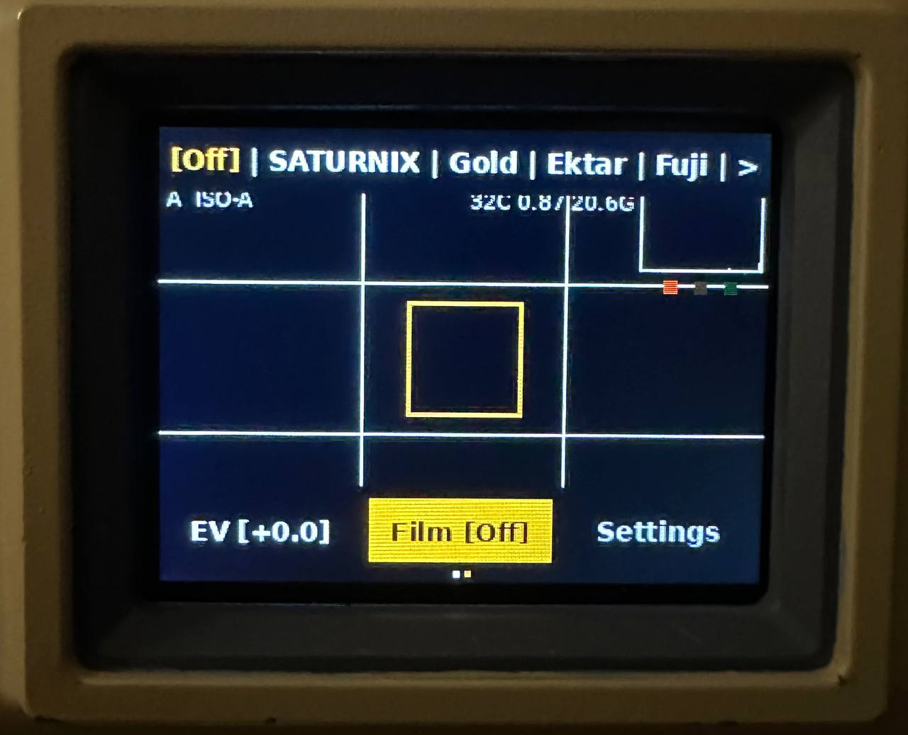
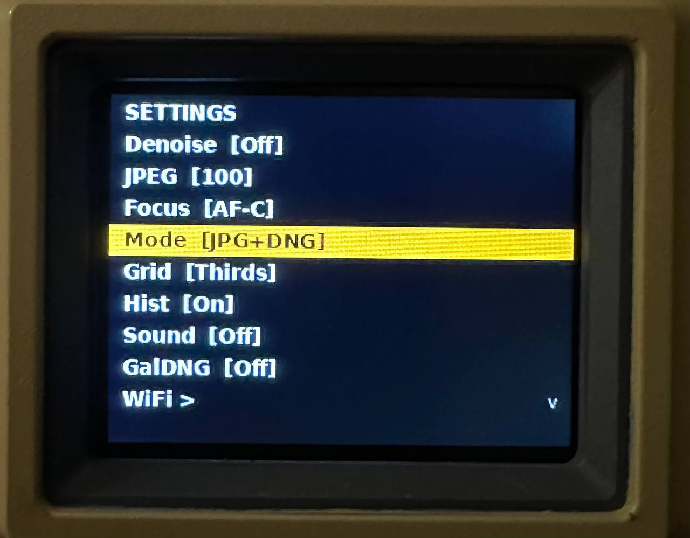
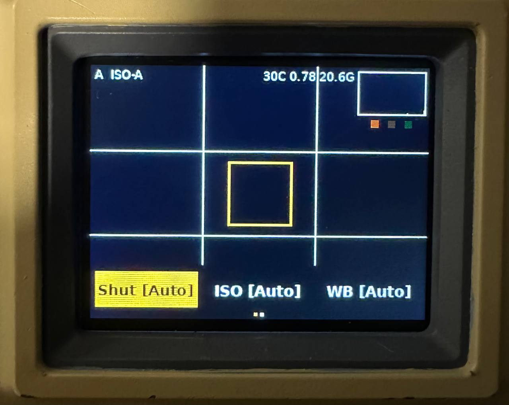

# SATURNIX

### Open-source digital camera with film simulation

  

> 🚧 **Firmware release coming soon.** Star this repo to get notified.

---
Join the **Saturnix** community:

---

## What is SATURNIX?

SATURNIX is a DIY digital camera built on Raspberry Pi Zero 2W with a 16MP autofocus sensor, 2" LCD viewfinder, and built-in film simulation engine. It shoots RAW+JPG and processes photos on-device with cinematic color profiles — from Kodak Gold to a custom anime-inspired preset.

No apps. No cloud. Just a camera.

---

## Features

**Camera**
- 16MP autofocus sensor (Arducam IMX519)
- RAW (DNG) + JPG capture
- Full manual controls: Shutter (30s–1/4000), ISO (100–3200), WB, EV
- Autofocus modes: AF-C (continuous with lock), AF-S (single shot), MF (manual)

**Film Simulations**
- **SATURNIX** — signature preset: golden light, anime-style rendering, indigo shadows, bloom
- **Kodak Gold 400** — warm, vintage, creamy tones
- **Kodak Ektar 100** — hyper-saturated, razor sharp, deep colors
- **Fujifilm 400** — cool greens, balanced tones
- **Kodak Tri-X 400** — classic black & white, deep blacks, rich grain
- **VHS** — lo-fi tape look: scanlines, chromatic aberration, noise

**Interface**
- 2" LCD live preview at 320×240
- Auto-hide UI (clean viewfinder after 15s)
- Live histogram with exposure traffic light
- Composition grids (Thirds, Golden Ratio, Cross)
- AF indicator with auto-detection
- CPU temperature & storage monitoring
- Persistent settings (survive reboot)

**Connectivity**
- Built-in WiFi hotspot for photo transfer
- Retro terminal-style web gallery
- No internet required — direct device-to-phone

**Audio**
- Passive buzzer feedback for all actions
- Customizable: shutter, focus, navigation, startup sounds
- Mute mode

---

## Hardware

| Component | Model |
|---|---|
| Board | Raspberry Pi Zero 2W |
| Sensor | Arducam IMX519 16MP Autofocus |
| Display | Waveshare 2" IPS LCD (240×320, SPI) |
| Audio | Passive buzzer (MH-FMD) on GPIO |
| Storage | microSD (32GB+) |
| Power | USB-C / PiSugar2 battery (optional) |

**Buttons:** 5× mechanical switches — Left, Right, Select, Capture, Focus

### 3D Printed Case

STL files for the camera case are available in the [`hardware/`](hardware/) directory.

---

## Camera Photo

  

  

  

  

  

---

## UI Photo

  

  

  

---

## Film Samples

  

No filter

  

Kodak Gold

  

Fuji

  

Kodak Tri-X

  

Saturnix film **(in development)**

---

## Photo Samples — Straight Out of Camera (No Filters)

  

  

  

  

---

## Roadmap

- [x] Live preview + full manual controls
- [x] RAW+JPG capture with sequential naming
- [x] Film simulation engine (6 presets)
- [x] Live histogram + exposure indicator
- [x] Composition grids
- [x] WiFi photo transfer (hotspot + web gallery)
- [x] Auto-hide UI
- [x] Persistent settings
- [x] Buzzer audio feedback
- [x] Gallery with DNG support
- [ ] Battery indicator (PiSugar2)
- [ ] Status LED
- [ ] Web-based configurator
- [ ] Firmware update via USB
- [ ] Camera body and design improvements
- [ ] Firmware cleanup
- [ ] Pre-built SD card image
- [ ] Open source release preparation
- [ ] Release

---

## Installation

> ⏳ Pre-built image and installation guide will be available with the first public release.

---

## Licensing

This project uses a **dual license** model:

| What | License | Commercial use |
|---|---|---|
| **Firmware** (Python code) | [MIT License](LICENSE) | Requires permission ([details](LICENSE-COMMERCIAL.md)) |
| **Hardware** (STL, 3D models) | [CC BY-NC-SA 4.0](hardware/LICENSE-HARDWARE.md) | Requires permission ([details](hardware/LICENSE-HARDWARE.md))|

**Personal, educational, and non-commercial use** — fully free and open.
**Commercial use** — contact [@Yutani140x](https://github.com/Yutani140x) for licensing.

---

## Support the Project

SATURNIX is a passion project built in spare time. If you find it interesting, consider supporting its development:

⭐ **Star this repo** to follow the development!

---

**Created by Yutani140x**

*SATURNIX — a camera that feels like film.*
